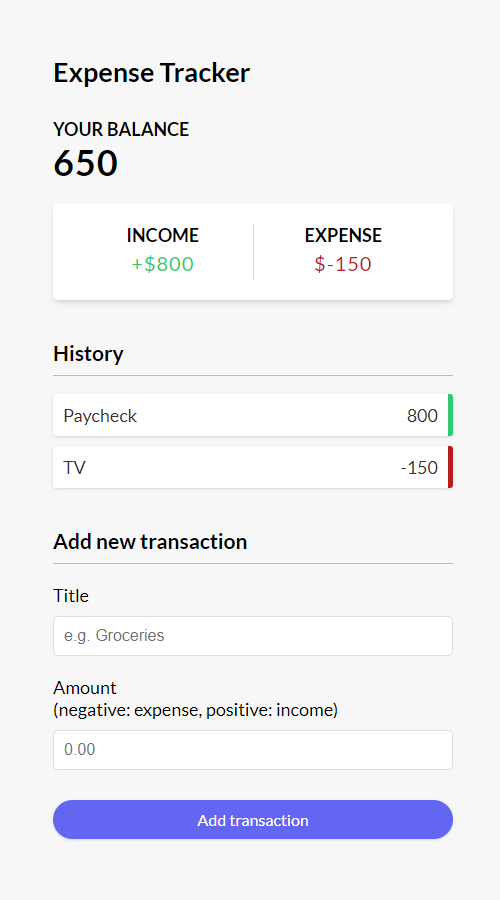

# Expense Tracker

An expense tracker app built with Vue 3 (composition API).

</img>

### Functions

- Add and remove income/expenses
- Track balance
- Save data to local storage

## My process
### Built with
- Vue
- PrimeVue (toast component)

### What I learned
- Understanding how to declare custom events using the `defineEmits()` macro.

```
<script setup>
const emit = defineEmits(['transactionDeleted']);

// Delete transaction
const deleteTransaction = (id) => {
	emit('transactionDeleted', id);
};
</script>
```

## Recommended IDE Setup

[VSCode](https://code.visualstudio.com/) + [Volar](https://marketplace.visualstudio.com/items?itemName=Vue.volar) (and disable Vetur).

## Project Setup

```sh
npm install
```

### Compile and Hot-Reload for Development

```sh
npm run dev
```

### Compile and Minify for Production

```sh
npm run build
```

## Notes

Tutorial: [Vue 3 & Composition API - Full Project](https://youtu.be/hNPwdOZ3qFU?si=3GqvStYjO7ZS6DLf)
